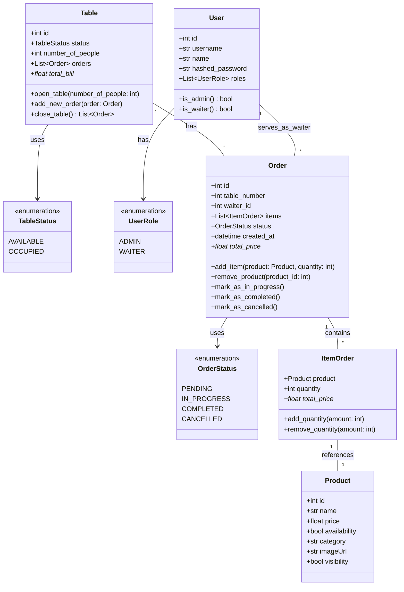

```mermaid
classDiagram
    %% --- ENUMS ---
    class OrderStatus {
        <<enumeration>>
        PENDING
        IN_PROGRESS
        COMPLETED
        CANCELLED
    }

    class TableStatus {
        <<enumeration>>
        AVAILABLE
        OCCUPIED
    }

    class UserRole {
        <<enumeration>>
        ADMIN
        WAITER
    }

    %% --- MAIN ENTITIES ---
    class Order {
        +int id
        +int table_number
        +int waiter_id
        +List~ItemOrder~ items
        +OrderStatus status
        +datetime created_at
        +float total_price*
        +add_item(product: Product, quantity: int)
        +remove_product(product_id: int)
        +mark_as_in_progress()
        +mark_as_completed()
        +mark_as_cancelled()
    }

    class ItemOrder {
        +Product product
        +int quantity
        +float total_price*
        +add_quantity(amount: int)
        +remove_quantity(amount: int)
    }

    class Product {
        +int id
        +str name
        +float price
        +bool availability
        +str category
        +str imageUrl
        +bool visibility
    }

    class Table {
        +int id
        +TableStatus status
        +int number_of_people
        +List~Order~ orders
        +float total_bill*
        +open_table(number_of_people: int)
        +add_new_order(order: Order)
        +close_table() List~Order~
    }

    class User {
        +int id
        +str username
        +str name
        +str hashed_password
        +List~UserRole~ roles
        +is_admin() bool
        +is_waiter() bool
    }

    %% --- RELATIONSHIPS ---
    Order "1" -- "*" ItemOrder : contains
    ItemOrder "1" -- "1" Product : references
    Table "1" -- "*" Order : has
    Order --> OrderStatus : uses
    Table --> TableStatus : uses
    User --> UserRole : has
    
    %% Implicit relationship through waiter_id
    User "1" -- "*" Order : serves_as_waiter
```