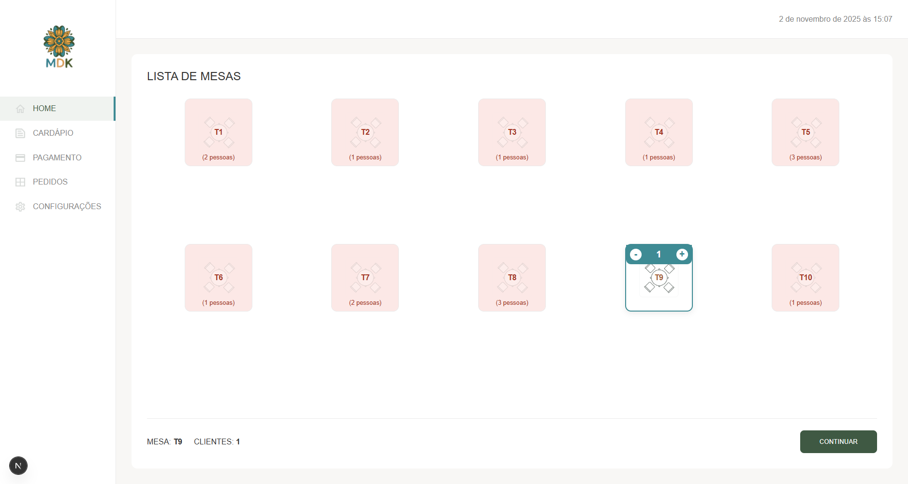
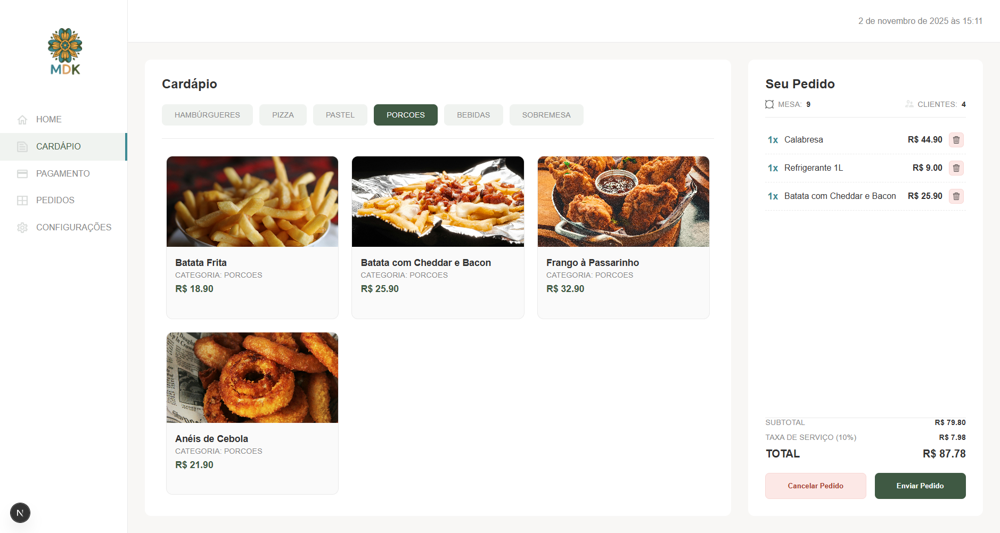
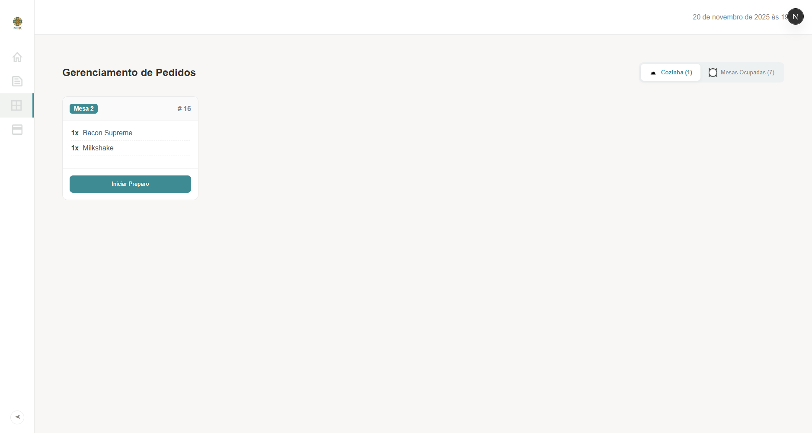
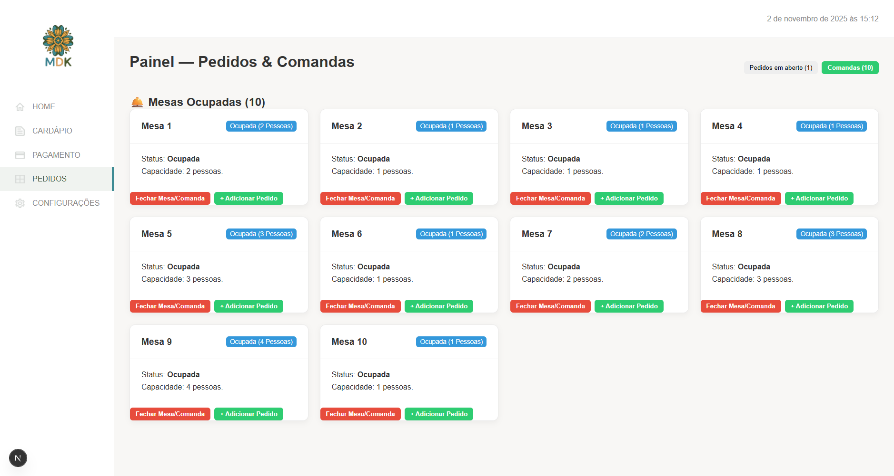

# Eng-de-Software-UFRN

Repositório de exemplo para as atividades da disciplina de Engenharia de Software da UFRN.

## Índice

- [Sobre o Projeto](#sobre-o-projeto)
  - [Título](#título)
  - [Descrição](#descrição)
  - [Telas da Aplicação](#telas-da-aplicação)
  - [Tecnologias e Arquitetura](#tecnologias-e-arquitetura)
- [Modelagem e Diagramas UML](#modelagem-e-diagramas-uml)
- [Componentes](#componentes)
- [Como clonar ou baixar](#como-clonar-ou-baixar)
- [Como Executar](#como-executar)
- [Estrutura do Projeto](#estrutura-do-projeto)
- [Licença](#licença)

## Sobre o Projeto

### Título
Mandaladaka

### Descrição
Um AppWeb de gerenciamento de restaurante para auxiliar na organização de mesas, pedidos e ítens disponíveis no estoque/cardápio.

### Telas da Aplicação

| Login | Lista de Mesas | Cardápio (Menu) |
| :---: | :---: | :---: |
|  |  |  |

| Pedidos Pendentes | Comandas |
| :---: | :---: |
|  |  |

### Tecnologias e Arquitetura

O sistema é dividido em duas partes principais (backend e frontend) que se comunicam via API REST.

| Área | Tecnologia | Propósito |
| :--- | :--- | :--- |
| **Backend** | `Python` + `Flask` | API REST |
| | `Arquitetura Hexagonal` | Isolamento da lógica de negócio |
| | `MySQL` | Banco de dados relacional |
| **Frontend**| `Next.js` + `React` | Interface do usuário (Web App) |
| | `TypeScript` | Tipagem e segurança no código |
| | `App Router` | Roteamento baseado em pastas |
| | `CSS Modules` | Estilização escopada |

#### Backend (API - Flask)
O backend utiliza a **Arquitetura Hexagonal (Portas e Adaptadores)**. O objetivo é isolar o "núcleo" da aplicação (lógica de negócio) do "mundo exterior" (Flask, MySQL).

* **O Núcleo (`src/domain`):** Contém a lógica de negócio pura (Modelos e Casos de Uso).
* **As Portas (`src/domain/ports.py`):** São interfaces (contratos) que o Núcleo define.
* **Os Adaptadores (`src/adapters`):** São as implementações concretas (Flask, MySQL) que se conectam às Portas.

*(Para mais detalhes, veja o `backend/README.md`)*

#### Frontend (Web App - Next.js)
O frontend utiliza **Next.js 13+** com o **App Router**.

* **`src/app/` (Roteamento):** O núcleo da aplicação. Cada pasta dentro de `app` se torna uma rota na URL.
* **`page.tsx` (UI):** Define a interface do usuário (UI) para uma rota específica.
* **`layout.tsx` (Layout):** Define uma UI compartilhada (como a `Sidebar` e o `Header`).
* **`src/components/` (Componentes):** Contém componentes React reutilizáveis.

*(Para mais detalhes, veja o `frontend/README.md`)*

## Modelagem e Diagramas UML

A arquitetura e o comportamento do sistema foram modelados utilizando diagramas UML para garantir clareza e consistência no desenvolvimento.

- **Diagrama de Classes:** Detalha a estrutura estática, as classes e seus relacionamentos.
- **Diagrama de Casos de Uso:** Mostra as funcionalidades do sistema pela perspectiva dos usuários (Atores).

Os diagramas visuais estão localizados na pasta `Diagrams` e a documentação detalhada sobre eles pode ser encontrada no arquivo `Diagramas.md`.

## Componentes
- Gabriel Sebastião do Nascimento Neto
- Sara Gabrielly do Nascimento Silva
- Icaro Bruno Silbe Cortês

## Como clonar ou baixar

Você pode obter este repositório de três formas:

### Clonar via HTTPS

```bash
git clone [https://github.com/gabriel26077/Mandaladaka](https://github.com/gabriel26077/Mandaladaka)
```

Isso criará uma cópia local do repositório em sua máquina.

### Clonar via SSH

Se você já configurou sua chave SSH no GitHub, pode clonar usando:

```bash
git clone git@github.com:gabriel26077/Mandaladaka.git
```

Isso criará uma cópia local do repositório em sua máquina.

### Baixar como ZIP

1. Acesse a página do repositório no GitHub:
   [https://github.com/gabriel26077/Mandaladaka](https://github.com/gabriel26077/Mandaladaka)
2. Clique no botão **Code** (verde).
3. Selecione **Download ZIP**.
4. Extraia o arquivo ZIP para o local desejado em seu computador.

## Como Executar

Este projeto utiliza `make` para automatizar o processo de instalação e execução.

**Pré-requisito:** Você precisa ter o `make` instalado em seu sistema.

Siga os passos abaixo:

1.  **Configurar o ambiente:**
    Primeiro, copie o arquivo de exemplo `config.mk.example` para um novo arquivo chamado `config.mk`.

    ```bash
    cp config.mk.example config.mk
    ```

    Em seguida, edite o `config.mk` com suas configurações locais (senhas de banco, chaves de API, etc.).

2.  **Instalar dependências:**
    Execute o comando abaixo para instalar todas as dependências do backend (Flask) e do frontend (Next.js).

    ```bash
    make install-all
    ```

3.  **Inicializar o Banco de Dados:**
    (Opcional, execute na primeira vez ou se precisar resetar o banco)
    Este comando irá criar as tabelas e popular o banco de dados.

    ```bash
    make init-db
    ```

4.  **Rodar os serviços:**
    Você precisará de dois terminais abertos.

    - No **primeiro terminal**, inicie o backend:
      ```bash
      make run-back
      ```

    - No **segundo terminal**, inicie o frontend:
      ```bash
      make run-front
      ```

Para encerrar os serviços, pressione `Ctrl+C` em cada um dos terminais.

## Estrutura do Projeto

```
Mandaladaka/
├── Makefile                 # Arquivo de automação 'make' para build, run e install.
├── config.mk                # Arquivo de configuração local (ignorado pelo git).
├── config.mk.example        # Exemplo de arquivo de configuração.
├── LICENSE                  # Licença MIT do projeto.
├── README.md                # Este arquivo de documentação.
├── backend/                 # Contém o código-fonte do backend (Flask).
├── frontend/                # Contém o código-fonte do frontend (Next.js).
├── database/                # Contém os scripts SQL para criação e população do banco.
├── docs/                    # Documentação e imagens
│   └── screenshots/         # Screenshots da aplicação
├── Diagrams/                # Contém os arquivos de imagem dos diagramas UML.
├── Diagramas.md             # Documentação detalhada dos diagramas UML.
├── backlog_user_stories.md  # Documento com o backlog e histórias de usuário.
└── 'Relatório de Princípios de projeto.md' # Documentação de arquitetura e design.
```

## Licença

Este projeto está licenciado sob a **Licença MIT**. Veja o arquivo `LICENSE` para mais detalhes.